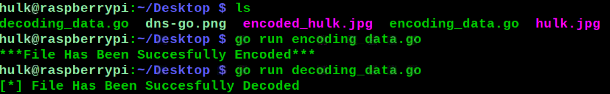

<h1><b>Steganography In Go</b></h1>
<h1><b>What Is Steganography?</b></h1>
<h2><i>Steganography is the technique of hiding secret data within an ordinary, non-secret, file or message in order to avoid detection; the secret data is then extracted at its destination. The use of steganography can be combined with encryption as an extra step for hiding or protecting data. The word steganography is derived from the Greek words steganos (meaning hidden or covered) and the Greek root graph (meaning to write).</h1></i>

#
 </a>

#
<h2><b> 😇 Author: Sumalya Chatterjee </b></h2>

#
<h1><b>❤️ Don't Copy, Do Fork 😊</b></h1>

#
<h1><b>See What This Tool Usually Does 👇</b></h1>



#

<h1><b>Git Installation </h1></b>

```
# Install Git
sudo apt install git

# Install Go
sudo apt install golang

# Git Clone
git clone https://github.com/R3DHULK/steganography-in-go

# Change Directory
cd steganography-in-go

# Run This Tool To Encode
go encoding_data.go

# Run This Tool To Encode
go decoding_data.go

```
#
<h2><b><i> Show Support 👇👇👇</b></i> </h2>
<a href="https://www.buymeacoffee.com/r3dhulk"> </a><br><br>

